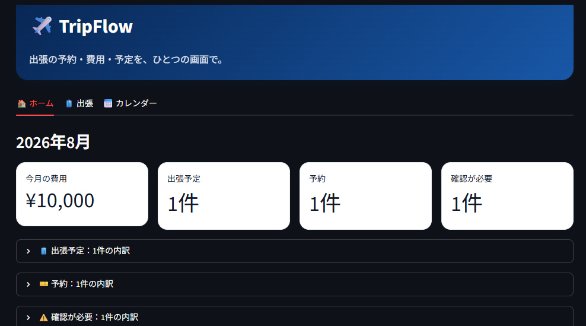
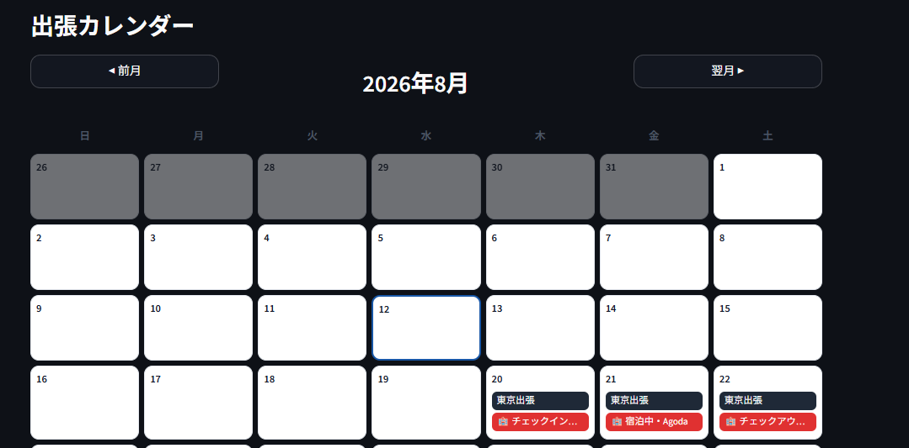

# TripFlow

出張の「予約」「予約漏れ」「費用」を、ひとつの画面でまとめて確認できる出張管理アプリです。

> 現在：Web v0.3（ローカル版）

---

## 目次

1. [TripFlowとは](#tripflowとは)
2. [開発背景・解決したい課題](#開発背景解決したい課題)
3. [Screenshots](#screenshots)
4. [Googleログイン・ユーザーごとのデータ分離（Web v0.3）](#googleログインユーザーごとのデータ分離web-v03)
5. [現在のWeb v0.3でできること](#現在のweb-v03でできること)
   - [ホーム画面](#ホーム画面)
   - [出張管理](#出張管理)
   - [予約管理](#予約管理)
   - [予約詳細カード](#予約詳細カード)
   - [予約漏れチェック](#予約漏れチェック)
   - [カレンダー](#カレンダー)
   - [ホテルのチェックイン・チェックアウト対応](#ホテルのチェックインチェックアウト対応)
   - [予約サービス別の色分け](#予約サービス別の色分け)
   - [スマートフォン対応](#スマートフォン対応)
6. [Web v0.2〜v0.3でのコード構成の改善](#web-v02v03でのコード構成の改善)
7. [使用技術](#使用技術)
8. [セットアップ方法](#セットアップ方法)
9. [Googleログインの設定（開発環境）](#googleログインの設定開発環境)
10. [起動方法](#起動方法)
11. [現在のフォルダ構成](#現在のフォルダ構成)
12. [今後のロードマップ](#今後のロードマップ)
13. [今後実装予定の機能（未実装）](#今後実装予定の機能未実装)
14. [現在の制限事項](#現在の制限事項)
15. [開発ステータス](#開発ステータス)

---

## TripFlowとは

TripFlowは、出張に関する予約情報を一つにまとめ、

- 何を予約済みか
- 何がまだ不足しているか
- 費用はいくらか

をすぐ確認できる出張管理アプリです。単なる出張記録ではなく、**「出張に必要な予約がそろっているかを3秒で確認できること」**を中心的な価値としています。

---

## 開発背景・解決したい課題

出張の予約情報は、Gmail・えきねっと・スマートEX・航空会社・ホテル予約サイト・電話予約・Googleカレンダーなど、複数のサービスに分散しがちです。そのため出張前に「予約が揃っているか」を確認するだけで、いくつものサービスを開き直す必要があります。

TripFlowは、これらの情報を一つの画面にまとめることで、出張が多い方・予約メールを探すのに時間がかかる方・予約漏れを防ぎたい方の負担を減らすことを目指しています。

---

## Screenshots

### 🏠 ホーム画面

TripFlowのホーム画面です。
今月の費用、出張予定、予約件数、確認が必要な出張、
直近の出張情報をまとめて確認できます。



### 📅 カレンダー

出張期間と予約情報を月間カレンダーで確認できます。
ホテル予約では、チェックイン・宿泊中・チェックアウトを
日ごとに確認できます。



---

## Googleログイン・ユーザーごとのデータ分離（Web v0.3）

Web v0.3では、TripFlowにGoogleアカウントでのログインを導入し、利用者ごとにデータを分離しました。

### ログイン・ログアウト

- Streamlitのネイティブ認証機能（`st.login()` / `st.logout()` / `st.user`）を利用し、Googleアカウントでログインできます
- 未ログイン状態では、出張・予約・カレンダーなどTripFlow本体の画面は一切表示されず、ログイン画面のみが表示されます
- ログイン後はヘッダーに「ようこそ、〇〇さん」と表示名（取得できない場合はメールアドレス）が表示され、「ログアウト」ボタンからいつでもログアウトできます
- ログアウト時は、TripFlow内部で使っているセレクトボックスの選択状態・削除確認フラグ・カレンダーの選択日などの一時的な状態（session_state）をすべてクリアしてからログアウト処理を行います

### ユーザーごとのデータ分離

- Googleアカウントごとに`users`テーブルへ1件登録され、以後すべての出張・予約はそのユーザーに紐づけて保存されます
- ユーザーの識別には、変更される可能性があるメールアドレスではなく、Googleが発行する不変の識別子（`sub`）を使用しています
- 出張データは`user_id`で所有者を管理し、予約データは出張（`trip_id`）経由で所有者を判定します
- 出張・予約の取得・更新・削除は、すべてログイン中のユーザーIDによる絞り込み・所有者チェックを経由します。他のユーザーの出張IDや予約IDを直接指定しても、閲覧・編集・削除は一切できません
- 万一、セレクトボックスの状態に存在しない、または他人のIDが残っていても、安全に未選択状態へ戻り、アプリがクラッシュしたり他人のデータが表示されたりすることはありません

### 既存データ（Web v0.2以前）の扱い

- Web v0.2以前（ログイン機能が無かった時代）に登録されたデータは、`legacy user`という特別な内部ユーザーに割り当てられた状態で保持されています
- 実際にご自身のGoogleアカウントでログインできることを確認したうえで、`legacy user`のデータをそのアカウントへ移行する作業を別途行います（データの削除は行いません）

---

## 現在のWeb v0.3でできること

Web v0.3では、Googleログイン・ユーザーごとのデータ分離（上記）に加えて、Web v0.1・v0.2で実装した出張・予約管理機能がそのまま利用できます。

### ホーム画面

- 今月の費用（`status=予約済み`の予約金額のみを集計。キャンセル済みの予約は除外）
- 今月の出張予定件数（月をまたぐ出張も重複なく1件としてカウント）
- 今月の予約件数
- 確認が必要な出張件数（今月の出張のうち、予約漏れがあるもの）
- 上記4項目はそれぞれ開閉式（`st.expander`）の内訳表示に対応し、タップ／クリックで詳細を確認可能
- 直近の出張（最大3件）を開閉式カードで表示し、行き先・予約漏れ状況・その出張の予約一覧を確認可能
- **［Web v0.2で追加］出張タブへの詳細導線**：「出張予定」「予約」「確認が必要」「直近の出張」の各項目に「詳細へ」ボタンがあり、押すと出張タブ側で該当の出張（予約から押した場合はその予約も）が自動的に選択された状態になります。Streamlitの仕様上タブの自動切り替えはできないため、出張タブを開くと選択済みの状態が確認できる形です

### 出張管理

- 出張の新規登録（出張名・行き先・開始日・終了日・分類［業務／プライベート／未分類］・メモ）
- 入力チェック（出張名必須、終了日は開始日以降）
- 出張一覧表示（予約状況列つき）
- 出張の編集・削除（削除は確認ステップあり）

### 予約管理

- 予約の新規登録・編集・削除（対象は編集・削除ともにセレクトボックスで明確に指定）
- 項目：種類（往路／ホテル／復路／その他）、サービス（えきねっと／スマートEX／スカイマーク／Agoda／その他）、予約名、利用日（またはホテルのチェックイン・チェックアウト日）、金額、予約番号、予約確認URL、状態（予約済み／未予約／キャンセル）、メモ
- 出張とのひもづけ（`ON DELETE CASCADE`により、出張削除時に関連予約も自動削除）
- 削除前に種類・サービス・予約名・日付（または宿泊期間）・金額を表示する確認ステップあり
- 予約確認URLはhttp/https以外のスキーム（`javascript:`など）をリンクとして表示しない安全対策つき

### 予約詳細カード

**［Web v0.2で追加］** 出張タブの各予約を、項目ごとに開閉できるカード形式で確認できます。

- 種類・サービス・予約名・利用日（ホテルはチェックイン日／チェックアウト日）・金額・予約番号・予約確認URL・状態・メモを、「項目名」を上、「値」を下に積んだ形式で表示（スマホでも文字が詰まらないレイアウト）
- 値が未入力の項目は「なし」、ホテルのチェックアウト日が未設定の場合は「未設定」と表示
- 予約確認URLが安全なリンク（http/https）の場合のみ「予約確認ページを開く」ボタンを表示
- 状態に応じたバッジ（✅予約済み／⚠️未予約／🚫キャンセル）を表示
- 従来の一覧表（`st.dataframe`）は「予約一覧（表）」として引き続き利用可能

### 予約漏れチェック

- 出張ごとに「往路」「ホテル」「復路」それぞれに`status=予約済み`の予約が存在するかを自動判定
- 3つとも揃っていれば「予約完了」、1つでも不足していれば「確認が必要」と表示
- `未予約`・`キャンセル`の予約は完了扱いにしない

### カレンダー

- 月間カレンダー表示（前月・翌月への移動、今日の日付をハイライト）
- 出張期間を黒系のバーで表示（複数日にまたがる出張・月をまたぐ出張にも対応）
- 予約をサービスごとに色分け表示（詳細は次項）
- キャンセル済みの予約は取り消し線、未予約の予約は破線枠で区別
- 日付を選択すると、その日に関係する出張・予約の詳細を画面下部に表示
  - **［Web v0.2で改善］** 「🧳 出張」「🚄 往路」「🏨 ホテル」「🚄 復路」「📌 その他予約」ごとにグループ化されたカード形式で表示（予約詳細カードと同じ形式）
  - **［Web v0.2で改善］** ホテル予約は選択した日が「🟢 チェックイン」「🔵 宿泊中」「🟠 チェックアウト」のどの段階かをバッジで表示
- **［Web v0.2で改善］** 月表示グリッドは、スマホ幅（390px／375px／360pxで確認済み）でも横スクロールなしで日〜土の7列すべてが画面内に収まるようにレスポンシブ対応（PC幅では従来どおりのグリッド幅・余白を維持）

### ホテルのチェックイン・チェックアウト対応

- ホテル予約のみ、チェックイン日・チェックアウト日を個別に入力（チェックアウト日はチェックイン日より後である必要あり）
- カレンダー上では宿泊期間全体を表示し、日ごとに「チェックイン」「宿泊中」「チェックアウト」を区別して表示
- 既存データ（チェックイン日のみ記録されていた予約）は、安全なマイグレーションにより自動的に「チェックイン日＝利用日」として移行済み（チェックアウト日は推測せずNULLのまま）

### 予約サービス別の色分け

カレンダー上で、予約サービスごとに色分けして表示します。

| サービス | 色 |
|---|---|
| 出張期間 | 黒系 |
| えきねっと | 緑系 |
| スマートEX | 水色系 |
| スカイマーク | 黄色系 |
| Agoda | 赤系 |
| その他 | グレー系 |

### スマートフォン対応

**［Web v0.2で追加］** PC向けのレイアウト（`layout="wide"`、横並びカラム、カレンダーグリッド構造）を維持したまま、狭い画面幅でも主要操作が行えるように調整しています。

- カレンダーの月表示グリッドは、スマホ幅で横スクロールなしに7列すべてが画面内に収まる（詳細は上記カレンダー参照）
- 予約詳細カード・日付詳細カードは、項目を「ラベル→値」の縦積みで表示し、狭い画面でも文字が詰まらない
- ホーム画面の各項目の「詳細へ」ボタン、出張登録・予約登録フォームの日付2カラム（開始日／終了日、チェックイン日／チェックアウト日）などは、Streamlitの`st.columns`が持つ画面幅に応じた自動縦積みの挙動を利用しており、狭い画面では自然に縦並びになる
- ボタンの最小高さ・フォントサイズを調整し、タップしやすくしている
- 実機（スマートフォン）でカレンダー・予約カード・ホームの導線ボタンの表示を確認済み

---

## Web v0.2〜v0.3でのコード構成の改善

機能面の変更ではありませんが、以下のコード構成の改善を行いました。

- **表示ロジックの共通化**（v0.2）：出張・予約の表示に関する定数・整形関数・カード表示コンポーネント（`render_reservation_card`、`render_trip_card`など）を`web/components.py`に切り出し、ホーム／出張／カレンダーの各画面で重複していた表示コードを共通化しました
- **DB読み取り時のエラー処理**（v0.2）：これまで書き込み（登録・更新・削除）にのみ行っていた`sqlite3.Error`のハンドリングを、読み取り処理（`safe_fetch`）にも追加し、DBの読み込みに失敗した場合でも画面全体がクラッシュせず、エラーメッセージを表示したうえで空データとして継続表示するようにしました
- **所有者チェック付きCRUD**（v0.3）：`database.py`の出張・予約に関する全関数がログインユーザーのIDを必須で受け取り、取得・更新・削除の際にSQL文中で所有者条件を確認するようになりました。更新・削除は影響行数（0件なら「対象が存在しないか権限が無い」）を返す設計です
- **session_stateの安全なクリア**（v0.3）：`clear_stale_selection()`を新設し、削除やユーザー切り替えなどでセレクトボックスの選択状態に無効なIDが残っても、アプリがクラッシュせず安全に未選択状態へ戻るようにしました

---

## 使用技術

- [Python](https://www.python.org/)
- [Streamlit](https://streamlit.io/) 1.60.0（ネイティブ認証機能`st.login()`/`st.logout()`/`st.user`を利用）
- [SQLite](https://www.sqlite.org/)（Python標準の`sqlite3`モジュール）
- [pandas](https://pandas.pydata.org/) 3.0.5
- [Authlib](https://authlib.org/)（Streamlitの認証機能が内部で使用）
- [httpx](https://www.python-httpx.org/)（Streamlitの認証機能が実行時に必要とする依存ライブラリ）

---

## セットアップ方法

```bash
# リポジトリのルートで仮想環境を作成
python -m venv .venv

# 仮想環境を有効化
# Windows
.venv\Scripts\activate
# macOS / Linux
source .venv/bin/activate

# 依存ライブラリをインストール
pip install -r web/requirements.txt
```

---

## Googleログインの設定（開発環境）

Web v0.3からGoogleログインが必須になったため、起動前に以下の設定が必要です。

1. Google Cloud ConsoleでOAuthクライアントID（ウェブアプリケーション）を作成し、承認済みのリダイレクトURIに `http://localhost:8501/oauth2callback` を登録します
2. リポジトリのルート（`TripFlow/`。`web/`配下ではありません）に `.streamlit/secrets.toml` を作成し、`client_id` / `client_secret` / ランダムな `cookie_secret` を設定します

   ```toml
   [auth]
   redirect_uri = "http://localhost:8501/oauth2callback"
   cookie_secret = "（ランダムな文字列）"
   client_id = "（Google Cloud Consoleで発行されたクライアントID）"
   client_secret = "（同、クライアントシークレット）"
   server_metadata_url = "https://accounts.google.com/.well-known/openid-configuration"
   ```

3. `.streamlit/secrets.toml`は`.gitignore`で除外されており、GitHubにはコミットされません。**実際の値を直接コードやドキュメントに記載しないでください**

Streamlitは、`streamlit run`を実行したときの**作業ディレクトリ**基準で`.streamlit/secrets.toml`を探します。TripFlowは通常リポジトリルートを作業ディレクトリとして起動するため、配置場所を`web/`配下にしないよう注意してください。

---

## 起動方法

```bash
streamlit run web/app.py
```

ブラウザで `http://localhost:8501` が自動的に開きます。未ログイン状態ではログイン画面のみが表示され、Googleアカウントでログインすると出張・予約・カレンダーの画面が使えるようになります。データは `web/data/tripflow.db`（SQLite）に保存されます（このファイルは`.gitignore`対象です）。

---

## 現在のフォルダ構成

```
TripFlow/
├── README.md
├── .gitignore
├── data/
│   └── tripflow_data.csv      Desktop版（CSV時代）のデータ
├── desktop/
│   └── versions/               Desktop版 v0.1〜v0.6（tkinter／試作完了として凍結）
├── docs/
│   ├── design.md                設計書
│   ├── roadmap.md                開発ロードマップ
│   └── screenshots/              スクリーンショット置き場
├── .streamlit/
│   └── secrets.toml               Googleログイン用の秘密情報（.gitignore対象、リポジトリには含まれない）
└── web/                          ★ Web v0.3（本体）
    ├── app.py                    Streamlitアプリ本体（ログインゲート・タブ構成・フォーム・カレンダー描画）
    ├── components.py              表示用の定数・整形関数・カード表示コンポーネント
    ├── database.py                SQLiteアクセス層（テーブル定義・CRUD・所有者チェック）
    ├── requirements.txt
    └── data/
        └── tripflow.db            SQLiteデータベース（users/trips/reservationsテーブル。.gitignore対象）
```

---

## 今後のロードマップ

`docs/roadmap.md`に沿って開発しています。カレンダー表示・予約サービス別の色分け・ホテルのチェックイン／チェックアウト管理は、当初の計画では後続バージョンの予定でしたが、Web v0.1の段階で先行して実装済みです。

| フェーズ | 内容 | 状態 |
|---|---|---|
| Phase 1（Web v0.1） | Web版の基礎、出張・予約管理、カレンダー | ✅ 完了 |
| Phase 1（Web v0.2） | 詳細表示・導線の改善、スマホ対応、コード構成の改善 | ✅ 完了 |
| Phase 2（Web v0.3） | Googleログイン、ユーザーごとのデータ分離 | ✅ 完了 |
| Phase 3〜4（Web v0.4〜v0.6） | Gmail連携、Googleカレンダー連携、経路案内 | 未着手 |
| Phase 5（Web v0.7） | 費用の月別／年別集計、領収書管理 | 未着手 |
| Phase 6（Web v1.0） | 本番環境への公開 | 未着手 |

Web v0.2では、当初`docs/roadmap.md`のv0.2予定にあった「検索」「絞り込み」は見送り、実際に使ったときの見やすさ・確認しやすさ・操作性の改善（予約詳細カード、カレンダー日付詳細のカード化、ホームからの導線、スマホ対応）を優先しました。検索・絞り込みは今後のバージョンで改めて検討します。

---

## 今後実装予定の機能（未実装）

以下はまだ実装されていません。

- Gmail API連携
- Gmailの予約メール自動解析
- Google Calendar連携
- 経路検索（Google Maps連携）
- AIによる予約内容の解析
- カレンダー上での予約バー直接クリックによる詳細表示（現在は日付選択方式）
- 出張・予約の検索／絞り込み機能
- 複数Googleアカウントの同時連携
- 管理者画面
- 本番Web環境への公開

---

## 現在の制限事項

- 1つのGoogleアカウントにつき1ユーザーとして扱う想定で、複数アカウントの同時連携には対応していません
- データは起動している端末のローカルSQLiteファイルに保存され、複数端末間の同期はできません
- カレンダーはバーを直接クリックする方式ではなく、日付を選択して詳細を確認する方式です
- 金額は円単位の整数のみ対応しています
- 予約確認URLはhttp／https以外のスキームをリンクとして表示しません（スキームなしの入力は自動的に`https://`を補完します）
- 出張・予約の検索／絞り込み機能はまだありません
- ホームの「詳細へ」ボタンを押しても、Streamlitの仕様上タブは自動的に切り替わりません（出張タブを開くと選択済みの状態になります）
- 実機（スマートフォン）でのカレンダー・予約カード・ホームの導線ボタンの表示は確認済みですが、全操作・全画面幅を網羅した実機確認はまだ行っていません
- Gmail APIとの連携はまだ実装していません（Googleアカウントでのログインのみで、メールの読み取りは行いません）
- 管理者画面は無く、ユーザーの一覧確認・削除等はできません

---

## 開発ステータス

- **現在：Web v0.3（ローカル版・完成）**
- Desktop版（tkinter、v0.1〜v0.6）は試作完了として凍結し、Web版への移行を進めています
